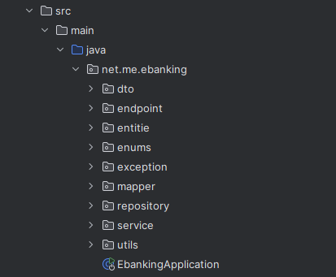
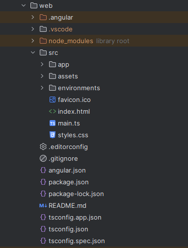

# 💳 Application de Gestion des Comptes Bancaires

Cette application permet de gérer des comptes bancaires pour des clients, avec des opérations de type **DEBIT** et **CREDIT**. Elle inclut une interface backend en **Spring Boot** et un frontend en **Angular**, avec une **authentification sécurisée par JWT**.

## 🔧 Technologies utilisées

### Backend
- Java 17+
- Spring Boot 3
- Spring Data JPA
- Spring Security
- JWT (JSON Web Token)
- Springdoc OpenAPI (Swagger UI)
- H2 / MySQL
- Lombok

### Frontend
- Angular 17+
- TypeScript
- Angular Material
- RxJS

---

## 📁 Architecture

### Modèle de données

- **Customer** : Représente un client
- **BankAccount** *(abstract)* :
    - `SavingAccount` : Compte épargne (+ interestRate)
    - `CurrentAccount` : Compte courant (+ overdraft)
- **AccountOperation** : Opérations associées à un compte (CREDIT / DEBIT)

---

